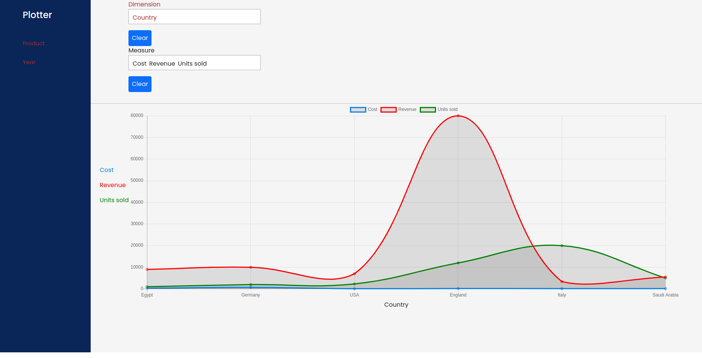

# Plotter

This app help you to track your revenue and sells by data
visualization.

You can add one dimension in dimension field and one or more in measure filed. (add it by drag and drop)

### Used Technology

1. Angular (Front-end)
2. Bootstrap (Front-end)
3. Nodejs (Back-end)
4. Express (Back-end)

# Run the application

**After cloning the project**

### Back End (APIs)

1. Goto APIs Folder (cd APIs)
2. Type the following command in terminal npm start
3. angular will run on http://localhost:8000/

### Front End

1. Goto Front Folder (cd Front)
2. Type the following command in terminal npm start
3. angular will run on http://localhost:4200/

# Screenshot from plotter

